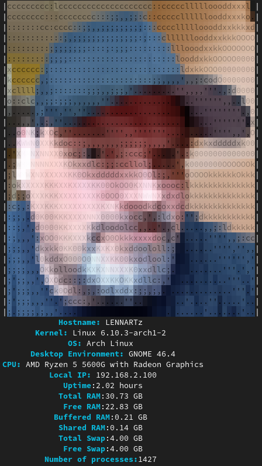
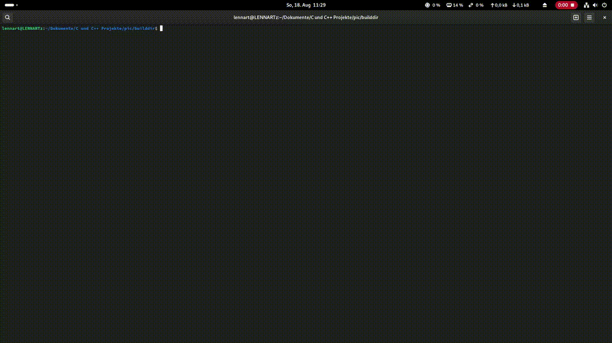

# sysinfo
My personal small system info CLI app written in C.

Included tools / gimmicks in this build: 'picinfo', 'ascii2c' and 'shuffle-ascii'.

See the videos below.

Build with meson:

```bash
mkdir builddir && meson setup builddir && cd builddir && meson compile
```

</img>

The 'picinfo' tool:

</img>

The 'shuffle-ascii' gimmick:

</img>

How to get an ASCII image into the compiled binary file:
1. Convert the picture with a tool like "jp2a" or "artem" to ASCII
2. You can use my small helper tool "ascii2c" to convert ASCII to a .c file
3. Include your .c file in your main program
4. Use "printf(ansi_pic);" in your code to display the colored image in the terminal

Have fun !

Lennart
